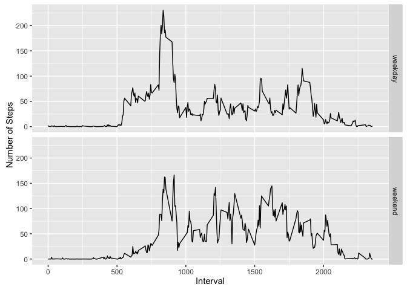

# Reproducible Research: Peer Assessment 1


##First, load some libraries...

```r
library(foreach)
library(doParallel)
```

```
## Loading required package: iterators
```

```
## Loading required package: parallel
```

```r
library(reshape2)
library(ggplot2)
```


##Loading and preprocessing the data

```r
activity <- read.csv("activity.csv")
```


##What is mean total number of steps taken per day?
(For this part of the assignment, you can ignore the missing values in the dataset.)

###1. Calculate the total number of steps taken per day

```r
steps_by_day <- tapply(activity$steps,activity$date,sum)
```

###2. Make a histogram of the total number of steps taken each day

```r
qplot(steps_by_day, geom="histogram")
```

```
## `stat_bin()` using `bins = 30`. Pick better value with `binwidth`.
```

```
## Warning: Removed 8 rows containing non-finite values (stat_bin).
```


###3. Calculate and report the mean and median of the total number of steps taken per day

```r
median(steps_by_day, na.rm = TRUE)
```

```
## [1] 10765
```

```r
mean(steps_by_day, na.rm = TRUE)
```

```
## [1] 10766.19
```

##What is the average daily activity pattern?

###1. Make a time series plot of the 5-minute interval (x-axis) and the average number of steps taken, averaged across all days (y-axis)

```r
avesteps <- tapply(activity$steps, activity$interval, mean, na.rm=TRUE)
steps_by_interval <- as.data.frame(as.matrix(avesteps))
steps_by_interval$V2 <- names(avesteps)
names(steps_by_interval) <- c("steps","interval")
plot(y=steps_by_interval$steps,x=steps_by_interval$interval, type ='l')
```


###2. Which 5-minute interval, on average across all the days in the dataset, contains the maximum number of steps?

```r
steps_by_interval[which.max(steps_by_interval$steps),]
```

```
##        steps interval
## 835 206.1698      835
```

##Imputing missing values

###1. Calculate and report the total number of missing values in the dataset (i.e. the total number of rows with NAs)

```r
sum(is.na(activity$steps))
```

```
## [1] 2304
```

###2. Devise a strategy for filling in all of the missing values in the dataset. The strategy does not need to be sophisticated. 

I chose to use the mean for the 5-minute interval to replace missing steps values.  

###3. Create a new dataset that is equal to the original dataset but with the missing data filled in.

```r
#for each interval in the dataframe
#replace NA steps with the average steps for that interval across all the days
intervals = unique(activity$interval)
for(i in 1:length(intervals)) {
        #get the mean steps value for this interval
        replacement = mean(activity[activity$interval == intervals[i],]$steps, na.rm = TRUE)
        #make sure there are NA's in this interval before replacing, to avoid error on replacement
        if (nrow(activity[is.na(activity$steps) & activity$interval==intervals[i],])>0) {
                #replace all NA's with the mean for that interval across all the days 
                activity[is.na(activity$steps) & activity$interval==intervals[i],]$steps<-replacement
        }
}
```

###4a. Make a histogram of the total number of steps taken each day

```r
steps_by_day2 <- tapply(activity$steps,activity$date,sum)
qplot(steps_by_day2, geom="histogram")
```

```
## `stat_bin()` using `bins = 30`. Pick better value with `binwidth`.
```


###4b. Calculate and report the mean and median total number of steps taken per day.

```r
median(steps_by_day2, na.rm = TRUE)
```

```
## [1] 10766.19
```

```r
mean(steps_by_day2, na.rm = TRUE)
```

```
## [1] 10766.19
```

###4b. Do these values differ from the estimates from the first part of the assignment? What is the impact of imputing missing data on the estimates of the total daily number of steps?

The mean value is exactly the same while the median changed to be equal to the mean; imputing the missing values by replacing with the mean for that interval had the effect of pulling the median closer to the mean, but the effect was very small. 

##Are there differences in activity patterns between weekdays and weekends?


###1. Create a new factor variable in the dataset with two levels – “weekday” and “weekend” indicating whether a given date is a weekday or weekend day.

```r
#This function accepts the name of a day and returns "weekend" or "weekday" as appropriate
wkend <- function (day) {
        if (day %in% c("Saturday","Sunday")) return("weekend")
        if (day %in% c("Monday","Tuesday","Wednesday","Thursday","Friday")) return("weekday")
        return("not a day of the week")
}

activity$weekEndOrDay <- as.factor(
        foreach(day = activity$date, .combine = 'c') 
        %do% wkend(weekdays(as.Date(day)))
        )
```

###2. Make a panel plot containing a time series plot (i.e. type = "l") of the 5-minute interval (x-axis) and the average number of steps taken, averaged across all weekday days or weekend days (y-axis). 

```r
#calculate the mean by interval and day type
avesteps2 <- with(activity, tapply(steps, list(weekEndOrDay, interval), mean, na.rm=TRUE))

#transform the data for graphing
dtavesteps2 <- as.data.frame(t(avesteps2))
dtavesteps2$interval <- rownames(dtavesteps2)
mdtavesteps2 <- melt(dtavesteps2)
```

```
## Using interval as id variables
```

```r
names(mdtavesteps2) <- c("Interval", "DayType", "Steps")
mdtavesteps2$Interval=as.numeric(as.character(mdtavesteps2$Interval))

#plot!
ggplot(data=mdtavesteps2, aes(x=Interval, y=Steps, group=1)) + 
        geom_line() + facet_grid(DayType ~ .) + 
        scale_x_continuous(breaks = seq(0,2000,500)) + 
        ylab("Number of Steps")
```




